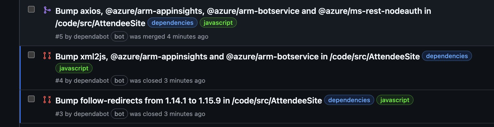

## Step 4: Enable and trigger Dependabot version updates

_Nicely done!_ :partying_face:

You now have automated the process for Dependabot to alert you to vulnerabilities with your dependencies and to create pull requests to update them to secure versions! At this point, you only need to review the pull request and then merge it to stay on top of security problems with Dependencies.

> [!NOTE]  
> Did you notice that there were several pull requests suggested by Dependabot? You only merged the one related to the **axios** dependency, but the others disappeared from the **Pull requests** panel. That's because the upgrade of the axios dependency triggered changes of other transitive dependencies, that might be either removed or updated to other versions. Whenever there is a change in your dependency graph, Dependabot will automatically review the existing pull requests and close the ones that are no longer relevant. So don't merge everything at once, let Dependabot do the job for you! 



The security updates feature helps automate the process to resolve alerts, but what about just keeping up-to-date with version updates? We can also automate pull request generation for updated versions of dependencies using the Dependabot version updates feature.

**What are Dependabot version updates?**: In addition to security alerts, Dependabot can also take the effort out of maintaining your dependencies. You can use it to ensure that your repository automatically keeps up with the latest releases of the packages and applications it depends on. Similar to security alerts, Dependabot will identify an outdated dependency and create a pull request to update the manifest to the latest version of the dependency.

Let's see how this works!

### :keyboard: Activity 4.1: Enable and trigger Dependabot version updates

1. Navigate to the **Settings** tab and select **Advanced Security**.
1. Locate **Dependabot version updates** and click **Configure** to open a new file editor with pre-populated contents. The file is called `dependabot.yml`.
1. Notice that the file is prepopulated to update the GitHub actions in the repository, the `github-actions` package ecosystem.
1. Edit your `dependabot.yml` configuration file to include another entry. It should look like:

   ```yaml
   version: 2
   updates:
     - package-ecosystem: "github-actions"
       directory: "/"
       schedule:
         interval: "monthly"
     - package-ecosystem: "nuget"
       directory: "/code/"
       schedule:
         interval: "weekly"
   ```
  
   > 💡 **Tip:** While, you can edit and commit a file directly on github.com, you can also press the period key `.` to open a lightweight VS Code editor directly in browser.

1. Commit your changes directly to the `main` branch.
1. With the configuration file updated, Mona should already be busy checking your work. Give her a moment and keep watch in the comments. You will see her respond with progress info and the next lesson.

You have now configured Dependabot version updates to run and check for updates as follows:

- Check once a month for updates to GitHub Actions and create pull requests to update any that are out of date.
- Check once a week for updates to .NET packages and create pull requests to update any that are out of date. By default, this check runs on a Monday, to run the check on a different day, see [schedule.day](https://docs.github.com/en/code-security/dependabot/dependabot-version-updates/configuration-options-for-the-dependabot.yml-file#scheduleday).
